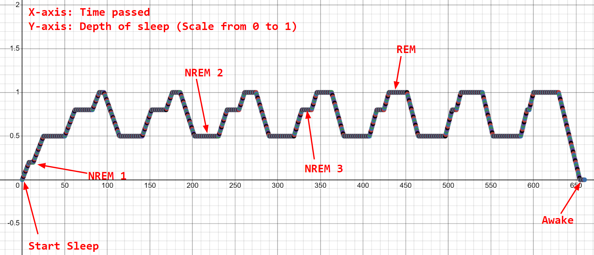

# Peep-RPG
A rogue-style ascii/terminal RPG game that runs on your local computer. Utilizes realistic physics for calculations to make interactions more realistic and interesting. 

This is my first programming project, so making this game was a learning process. My dad helped in the beginning to create an environment and things like displays and graphics of the game, but as time went on, he contributed less and I contributed more. The proceeding features mentioned in this document will be features that I have made/designed with little to no assistance.
## Requirements to Run Peep-RPG
- Python 3 installed on terminal
- Any computer with a terminal available for use
## How to run Peep-RPG
- gitclone
- cd into directory
- Command “python peep-rpg”

## Classes and Abilities
There are three classes in the game so far each with one passive and on active ability. All classes and abilites found here: [pclass.py](https://github.com/JeffBoss625/peep-rpg/blob/36c75792de6a4603c3c7b58e216c2eb666a0f46a/lib/pclass.py#L1)
### Warrior
The warrior class is based on melee combat and close quarters engagements. The passive ability for the warrior is "rage". Rage is activated autimatically once the player falls below 40% of their maximum health. When activated, rage will cause attacks to do more damage to opponents as well as have the player move faster. The activated ability, called "charge" will continuously increase the speed and damage of the player until the player stops moving in one continuous direction or hits an enemy.
### Ranger
The ranger class is a ranged class that specializes in ranged combat. The passive ability "speed adrenaline," allows for a large speed boost once the player reaches 20% of their maximum health. This can allow for a quick escape to disengage from close quarters combat back to the safety of long ranged combat. The activated ability "quickshot" allows for the player to rapid fire multiple ranged attacks in quick succession in the time span that would normally take up the time to shoot just one shot.
### Thief
The thief class is a close range specialist that relies on speed and trickery to fight. The thief's passive ability is "backstab." Backstab will deal extra damage if the target is facing the same direction as you: you are attacking them from behind. This allows the thief to capatalize on quick movements and trickery to deal more damage. The activated ability for the thief is "bypass" which allows the thief to quickly teleport past an enemy that is right next to the player. This can be used to get more damage with backstab by teleporting behind an enemy and stabbing them in the back. This can also be used as a quick escape if the player is cornered

## World Building


## Monster AI
The monster AI in peep-rpg is still in early implementation. As of now it uses [Dijkstra's Algorithm](https://www.geeksforgeeks.org/dijkstras-shortest-path-algorithm-greedy-algo-7/) to find the quickest path to the player. The algorithm itself was not a difficult feature to add to the project, it was simply a matter of finding a good implementation on the internet. However, the difficult issue was differenciating a room from a hallway and different exits and entrances to the dungeon. To do this I wrote an algorithm that works its way around the dungeon marking rooms and hallways, mapping out nodes and their weighted pathways between the nodes. This is found in the [find_path.py](https://github.com/JeffBoss625/peep-rpg/blob/a9f028137b327e69b7c45360a1f78ef452945327/lib/find_path.py#L1) file.

The future idea for AI of enemies, is that they will react to sound and light throughout the dungeon to add more depth to the game. Also, there will be monsters that aren't always hostile, or hostile to specific other monsters. This will add depth and greater story telling for the player.

## Sleep Cycles
Sleep cycles are implemented for the monsters to simulate real life sleeping patterns. The cycle that was used to model this is the 4 stage REM sleep cycle. This is used to make a calculation on how easily a monster will wake up due to noise: In the deeper stages of sleep like REM and NREM 3 the monster will respond less to sound and will not get up until a large amount of noise is made. However, when the monster is in NREM 1 and NREM 2, they will be easily awakened by any sound that the player makes. To demonstrate this idea here I graphed out the function for calculating the “deepness” of sleep:

Here is a part of the function for getting this result (more found in [sound.py](https://github.com/JeffBoss625/peep-rpg/blob/b81cc95dd393fc92573ab17a1129d4c1545f70ae/lib/items/sound.py#L67)):
```
def handle_sound(time, sleep):
   time_passed = time - sleep.age_checked
   sleep.age_checked = time
   rem = sleep.limit
   n3 = 0.8 * sleep.limit
   n2 = 0.5 * sleep.limit
   n1 = 0.2 * sleep.limit
   if sleep.total_cycles >= sleep.cycle_target:
       sleep.target = 0
       sleep.sleepiness -= 0.025 * time_passed * ((sleep.cycles * 0.1) + 1)
       if sleep.sleepiness <= sleep.target:
           sleep.sleepiness = sleep.target
           return time, sleep.sleepiness...  

            ...

            sleep.timer[1] = 20 * (1 - (sleep.cycles * 0.15))
           elif sleep.target == n2:
               sleep.timer[1] = 25 * (1 + (sleep.cycles * 0.05))
           else:
               sleep.timer[1] = 5
   else:
       sleep.timer[1] -= time_passed
   return time, sleep.sleepiness
```
## Physics
One of the key aspects of peep-rpg is the use of physics models and calculations to simulate interactions in the dungeon.
### Light and Sound
Inverse Square Law Equation: k/x
This equation helps represent the dissipation of light and sound within the dungeon by having x equal to the distance away from source of the light or sound, and k be the coefficient that will represent how quickly the sound/light dissipates. In the case of peep-rpg, light dissipates faster than sound because the dungeon echos sound. To represent this, the coefficient k is greater for sound than it is for light. 
```
def brightness_at(lightsources, pos):
   pos_x = pos[0]
   pos_y = pos[1]
   brightness = []
   for light in lightsources:
       distance_x = abs(light.pos[0] - pos_x)
       distance_y = abs(light.pos[1] - pos_y)
       tot_distance = sqrt(distance_x ** 2 + distance_y ** 2)
       if tot_distance == 0:
           brightness.append(light.brightness)
       else:
           brightness.append(light.brightness / (tot_distance ** 2))
```


Light determines how far or what the player is able to see in the dungeon:

Sound is in early implementation. Its only function is for waking monsters from their natural sleep cycles. The future idea for sound is to develop the AI of monsters to track the sounds that the player makes throughout the dungeon until the player is in sight.

### Items
Items play a large role in this game because of how physics is utilized in calculations. Each layer of armor has 8 qualities that change how damage is caluclated: elasticity, thickness, area, breaking_pt, plastic_region, toughness, hardness, and durability. Each attack has three qualities: velocity, area, and mass.

In order to calculate the force that a strike lands onto a target it will go through the function striking_blow(). The first step of this function is to calculate if the strike will pierce the armor based on how much pressure the attack has as well as the qualities of the layer of armor. If the attack pierces the layer of armor it will go onto the next layer of armor until reaching the body of the target. If the projectile/attack has enough force to continue piercing through the target it will do a maximum of 1/3 of their max health. However if the attack does not pierce it is calculated as a crushing attack in which the force is spread out before hitting the target. This force is converted into damage. Some examples of the results of these functions:


 (The calculations can be found in the [physics.py](https://github.com/JeffBoss625/peep-rpg/blob/c0fceb824f74b2340e7d783eba5b350063767049/lib/items/physics.py#L1C1-L1C1) file). 

**Note that some creatures and monsters that have thicker or unique skin will have their skin added in as an extra layer of armor in calculations.*
